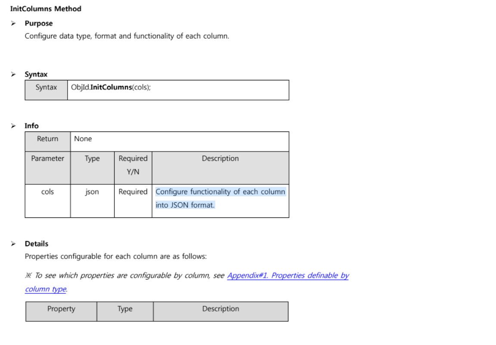

# PRACTICE 1

## InitColumns

    - InitColumns - Page 262 Document : Configure data type, format and functionality of each column || Định cấu hình kiểu dữ liệu, định dạng và chức năng của từng cột - JSON format
    * Example

    <javascript>
    var cols = [
                 { Type : "Status", Hidden : 1, Width : 50, Align : "Center", ColMerge : 0, SaveName : "ibflag" },
                 { Type : "CheckBox", Hidden : 0, Width : 50, Align : "Center", ColMerge : 0, SaveName : "del_chk" },
                 { Type : "Text", Hidden : 0, Width : 100, Align : "Center", ColMerge : 0, SaveName : "err_msg_cd", KeyField : 1, Format : "", UpdateEdit : 0, InsertEdit : 1, EditLen: 3 }];
    InitColumns(cols);
    </javascript>

## Comment Code in Markdown

- Dùng thẻ html hoặc javascript, ......

## InitHeaders

<javascript>
    var HeadTitle = "STS|Del|Msg Cd|Msg Type|Msg Level|Message|Description";
    	var headCount = ComCountHeadTitle(HeadTitle);

    	SetConfig({SearchMode : 2, MergeSheet : 5, Page : 20, DataRowMerge : 0});

    		var info = {Sort : 1, ColMove : 1, HeaderCheck : 0, ColResize : 1};
    		var headers = [ { Text : HeadTitle, Align : "Center" }];
    		InitHeaders(headers, info);

</javascript>

## EditLen

- Dùng để giới hạn dữ liệu nhập vào phải bé hơn EditLen.

ADM_SYS_007

# Request Parameters

## HtmlAction

- ErrMsgVO errMsgVO = new ErrMsgVO(); || file in VO
- errMsgVO.setErrMsg(JSPUtil.getParameter(request, "s_err_msg", ""));
- errMsgVO.setErrMsgCd(JSPUtil.getParameter(request, "s_err_msg_cd", ""));

## File Query

<javascript>
WHERE lang_tp_cd = 'ENG'

#if (${err_msg_cd} != '')

AND err_msg_cd LIKE '%'| |@[err_msg_cd]| |'%'

#end

#if (${err_msg} != '')

and UPPER(err_msg) like '%'| |UPPER(@[err_msg])| | '%'

#end
</javascript>
